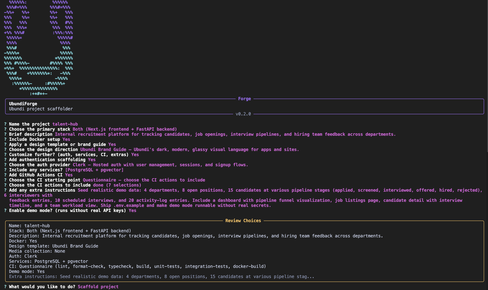
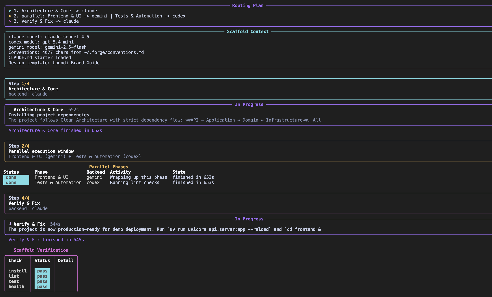

<p align="center">
  
</p>

<h1 align="center">UbundiForge</h1>

<p align="center">
  <strong>AI-powered project scaffolding with your team's conventions baked in.</strong>
</p>

<p align="center">
  <a href="https://github.com/matthewubundi/UbundiForge/actions/workflows/ci.yml"></a>
  <a href="https://github.com/matthewubundi/UbundiForge/releases/latest"></a>
  <a href="https://github.com/matthewubundi/UbundiForge/blob/main/LICENSE"></a>
  
</p>

<p align="center">
  <a href="#installation">Installation</a>&nbsp;&nbsp;&bull;&nbsp;&nbsp;<a href="#quick-start">Quick Start</a>&nbsp;&nbsp;&bull;&nbsp;&nbsp;<a href="#supported-stacks">Stacks</a>&nbsp;&nbsp;&bull;&nbsp;&nbsp;<a href="docs/README.md">Docs</a>&nbsp;&nbsp;&bull;&nbsp;&nbsp;<a href="CHANGELOG.md">Changelog</a>
</p>

---

UbundiForge is a CLI that collects a few project details, picks the best AI backend, assembles a structured prompt with your conventions, and hands off generation to **Claude Code**, **Gemini CLI**, or **Codex**. You get a production-ready project directory in minutes instead of hours.

<p align="center">
  
</p>

## Features

- **First-run setup wizard** -- detects installed AI CLIs, backend readiness, editors, git, and Docker
- **Multi-backend routing** -- picks the best AI backend per phase with quality-based learning
- **Interactive scaffold flow** -- review-and-edit screen with smart defaults that learn your patterns
- **Cinematic scaffold experience** -- phase timeline, activity feed, file tree, and post-scaffold dashboard
- **Convention injection** -- loads shared standards from `~/.forge/conventions.md`
- **Convention auditing** -- `forge check` audits any project against your standards with `--fix` and `--export`
- **Project augmentation** -- `forge evolve` adds capabilities (auth, Stripe, WebSockets, etc.) to existing projects
- **Scaffold analytics** -- `forge stats` shows your scaffold history and backend performance
- **Scaffold replay** -- `forge replay --diff` reproduces past scaffolds and detects drift
- **Secret scanning** -- checks user input for leaked credentials before passing to AI
- **Post-scaffold automation** -- manifest, git init, verification, hooks, Forge card, editor launch
- **Design templates** -- selectable brand guides for frontend-capable scaffolds
- **Shell completion** -- tab completion for all flags and options

## Supported Stacks

| Stack | Identifier | Aliases |
|-------|-----------|---------|
| Next.js + React | `nextjs` | `next`, `react` |
| FastAPI | `fastapi` | `api` |
| FastAPI + AI/LLM | `fastapi-ai` | `ai`, `llm` |
| Next.js + FastAPI Monorepo | `both` | `fullstack`, `monorepo` |
| Python CLI Tool | `python-cli` | `cli`, `typer` |
| TypeScript npm Package | `ts-package` | `npm-package`, `library` |
| Python Worker | `python-worker` | `worker`, `service` |

See [docs/guides/stacks.md](docs/guides/stacks.md) for detailed structure, libraries, and dev commands.

## Requirements

- Python 3.12+
- At least one AI CLI installed:
  - [`claude`](https://docs.anthropic.com/en/docs/claude-code) (Claude Code)
  - [`gemini`](https://github.com/google-gemini/gemini-cli) (Gemini CLI)
  - [`codex`](https://github.com/openai/codex) (Codex)

## Installation

### Homebrew (macOS)

```bash
brew tap matthewubundi/tap
brew install ubundiforge
```

### From source

```bash
git clone https://github.com/matthewubundi/UbundiForge.git
cd UbundiForge
uv sync --dev
```

Verify the installation:

```bash
forge --version
```

## Quick Start

### Interactive mode

```bash
forge
```

Forge walks you through the scaffold interactively, then shows a review screen before anything is generated.

<p align="center">
  
</p>

Once confirmed, Forge routes each phase to the best available backend and runs them with a live progress display.

<p align="center">
  
</p>

### Non-interactive mode

```bash
forge --name pulse --stack fastapi --description "health check API" --docker
forge --name storefront --stack nextjs --description "e-commerce site" --no-docker
forge --name platform --stack both --description "fullstack SaaS app"
```

### Dry run

Preview the assembled prompt without executing:

```bash
forge --dry-run
```

### Backend override

```bash
forge --use claude
forge --use gemini --model flash
```

## First-Run Experience

On first run, Forge launches a setup wizard that checks backend readiness, editor preference, git setup, Docker availability, and project-directory defaults, then saves your preferences to `~/.forge/config.json`.

After setup, Forge gives you a clean handoff -- create a project now, review setup again, or exit and come back later.

<details>
<summary>Testing a pristine first-run wizard</summary>

Temporarily move `~/.forge` out of the way instead of changing `HOME`:

```bash
mv ~/.forge ~/.forge.backup-$(date +%Y%m%d-%H%M%S)
forge
```

After testing, restore your original config:

```bash
rm -rf ~/.forge
mv ~/.forge.backup-YYYYMMDD-HHMMSS ~/.forge
```

Using `HOME="$(mktemp -d)"` can hide authentication files used by AI CLIs, causing scaffolding to fail even when the CLIs are installed.

</details>

## Configuration

All user config lives under `~/.forge/`:

| File | Purpose |
|------|---------|
| `config.json` | Editor, backends, model preferences, Docker, sound, and project directory settings |
| `conventions.md` | Team coding standards injected into every scaffold prompt |
| `hooks/post-scaffold.sh` | Custom script run after every scaffold |
| `scaffold.log` | Append-only JSON-lines scaffold history |
| `quality.jsonl` | Quality signals per scaffold (powers smart routing) |
| `preferences.json` | Answer frequency data (powers smart defaults) |

Re-run setup at any time:

```bash
forge --setup
```

See [docs/guides/configuration.md](docs/guides/configuration.md) for the full reference.

## Commands

Beyond the default scaffold flow, Forge includes purpose-built commands:

```bash
forge                        # Interactive scaffold (default)
forge stats                  # Scaffold analytics dashboard
forge evolve [capability]    # Add capabilities to existing projects
forge check                  # Convention drift detection
forge replay                 # Reproduce past scaffolds
```

## AI Agent Skill

Forge ships with a portable skill at `skills/forge-scaffold/` that teaches AI agents (Claude Code, Codex, Gemini CLI, or any agent that can read files and run shell commands) how to use Forge professionally.

**What it gives an agent:**
- How to detect and verify a Forge installation
- Complete command examples for every stack and option combination
- When to use `--dry-run` vs live scaffold vs `forge evolve`
- How to interpret the post-scaffold dashboard and fix verification failures
- How to audit projects with `forge check` and augment them with `forge evolve`
- Stack selection guidance, backend routing rules, and option support constraints

**How to use it:**

Point your agent at the skill file:

```
skills/forge-scaffold/SKILL.md
```

Or if using Claude Code with a CLAUDE.md, reference it:

```markdown
For project scaffolding, read skills/forge-scaffold/SKILL.md
```

The agent gets full context on all five commands, all seven stacks, smart defaults, quality routing, and the complete scaffold lifecycle -- so it can turn a rough product brief into a high-quality Forge run without guessing.

## CLI Reference

| Flag | Description |
|------|-------------|
| `--name`, `-n` | Project name |
| `--stack`, `-s` | Stack identifier or alias |
| `--description`, `-d` | Project description |
| `--use` | Override AI backend (`claude`, `gemini`, `codex`) |
| `--model`, `-m` | Model to pass to the AI CLI |
| `--docker` / `--no-docker` | Include Docker setup |
| `--auth-provider` | Auth provider (`clerk`, `supabase-auth`, `authjs`, `better-auth`) |
| `--ci` / `--no-ci` | Include GitHub Actions CI workflow |
| `--design-template` | Brand/design guide for frontend stacks |
| `--media` | Media collection to import into the project |
| `--demo` / `--no-demo` | Demo mode (runs without real API keys) |
| `--dry-run` | Print assembled prompt without executing |
| `--export` | Export prompt to a file |
| `--verbose` | Show full subprocess output and timing |
| `--open` / `--no-open` | Open project in editor after scaffolding |
| `--verify` / `--no-verify` | Run post-scaffold verification checks |
| `--setup` | Re-run the setup wizard |
| `--version`, `-v` | Show version |

### Subcommands

| Command | Flag | Description |
|---------|------|-------------|
| `forge stats` | | Show scaffold analytics |
| `forge check` | `--fix` | Auto-generate missing convention files |
| `forge check` | `--export FILE` | Export audit report to markdown |
| `forge evolve` | `CAPABILITY` | Capability to add (e.g., `auth`, `stripe`) |
| `forge evolve` | `--dry-run` | Preview the evolve prompt |
| `forge replay` | `--diff` | Compare replay against current project |
| `forge replay` | `--dry-run` | Preview reconstructed prompt |

## The Scaffold Experience

When Forge runs, you see the full journey:

1. **Phase timeline** -- a persistent progress bar showing completed, active, and pending phases with per-backend color coding.
2. **Activity feed** -- a scrolling log of what the AI is doing right now. Completed steps get checkmarks; the current step pulses.
3. **File tree** -- after each phase, a color-coded tree of everything created so far with file and line counts.
4. **Dashboard** -- when it's done, a project report card with health check results (lint, typecheck, tests, build, /health), scaffold stats (files, lines, phases, deps), and contextual next steps.

Every scaffolded project also gets a `.forge/card.svg` project card and a badge auto-injected into the README.

## Intelligence

Forge learns from every scaffold you run:

- **Quality memory** -- after each scaffold, Forge records whether lint, tests, typecheck, and health checks passed. Over time, it uses exponential moving average scoring to shift backend routing toward whichever AI CLI performs best for each stack and phase.
- **Smart defaults** -- Forge tracks your answer patterns. After 3+ scaffolds with consistent choices, it offers "Your usual setup: Auth: clerk, Docker: yes" with a single confirm prompt. Decline to see the full question flow; accept to skip straight to the review screen.
- **Scaffold analytics** -- `forge stats` renders a terminal dashboard: total scaffolds, success rate, stack distribution bar chart, per-backend performance rates, and your most recent projects.

## Convention Auditing

Run `forge check` in any project to audit it against Ubundi conventions:

```bash
forge check              # pass/warn/fail scorecard
forge check --fix        # auto-generate missing CLAUDE.md, .env.example, agent_docs/
forge check --export report.md  # save for PR reviews
```

Checks cover structure (required files and directories), tooling (Ruff config, MyPy strict, CI, pre-commit), and runtime (health endpoints, Docker non-root user, HEALTHCHECK). Stack is detected from `.forge/scaffold.json` or `pyproject.toml`/`package.json`.

## Project Augmentation

Instead of scaffolding from scratch, add capabilities to an existing Forge project:

```bash
cd my-project
forge evolve           # interactive menu
forge evolve auth      # add authentication directly
forge evolve stripe    # add Stripe billing
```

Available capabilities depend on the stack:

| Stack | Capabilities |
|-------|-------------|
| FastAPI | auth, websockets, s3-uploads, stripe, worker, monitoring |
| Next.js | auth, analytics, i18n |
| Both | all of the above |

Evolve reads the project's `.forge/scaffold.json` for context, assembles a targeted prompt with the current file tree and key source files, and routes through the same backend system as scaffolding.

## Scaffold Replay

Reproduce a past scaffold using the project's original inputs:

```bash
cd my-project
forge replay              # re-scaffold into a temp directory
forge replay --diff       # compare the replay against your current project
forge replay --dry-run    # preview the reconstructed prompt
```

Replay uses `.forge/scaffold.json` and `.forge/conventions-snapshot.md` (saved at scaffold time) for exact reproduction. The `--diff` flag recursively compares files and saves a report to `.forge/replay-diff-<date>.md`.

## How It Works

<p align="center">
  
</p>

1. **Setup** -- First-run wizard detects backends, checks readiness, saves defaults.
2. **Collect** -- Interactive flow or CLI flags gather project details. Smart defaults pre-fill repeat choices.
3. **Review** -- Edit selections before generation starts.
4. **Assemble** -- Loads conventions, templates, and scans for secrets.
5. **Route** -- Picks the best ready backend for each scaffold phase, informed by quality history.
6. **Execute** -- Launches AI CLIs with phase timeline, activity feed, and file tree visualization.
7. **Finalize** -- Writes manifest + conventions snapshot, generates Forge card, inits git, runs verification, plays completion sound, opens editor.

## Documentation

| Guide | Description |
|-------|-------------|
| [Docs Home](docs/README.md) | Map of user, maintainer, internal, and reference docs |
| [Getting Started](docs/guides/getting-started.md) | Installation, first run, first scaffold |
| [Configuration](docs/guides/configuration.md) | Config files, conventions, hooks, media assets |
| [Stacks](docs/guides/stacks.md) | Detailed reference for every supported stack |
| [Admin Playbook](docs/maintainers/admin-playbook.md) | Maintaining conventions, adding stacks, shipping releases |
| [Troubleshooting](docs/guides/troubleshooting.md) | Common issues and fixes |
| [Homebrew Release](docs/maintainers/homebrew-release.md) | Formula generation and release flow |

## Development

```bash
uv sync --dev                            # Install in dev mode
uv run pytest                            # Run tests
uv run ruff check src/ubundiforge tests  # Lint
uv run ruff format src/ubundiforge       # Format
```

## License

MIT -- see [LICENSE](LICENSE).
