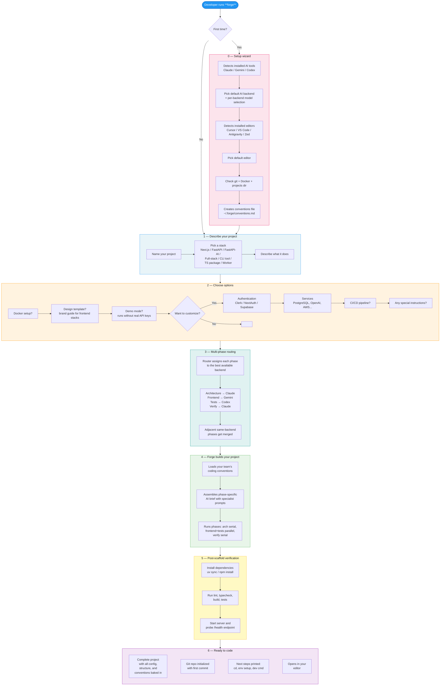
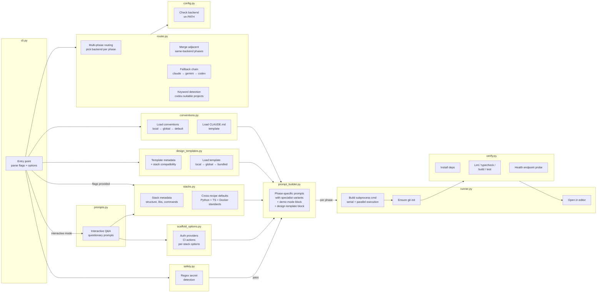
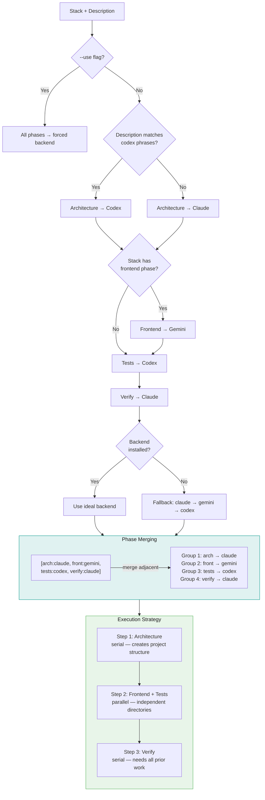

# UbundiForge — Flow Diagrams

## 1. User Flow (Product View)

How a developer goes from idea to running project with Forge.

## 2. Internal Pipeline

How data flows through Forge's modules during a scaffold run.

## 3. Prompt Assembly

What gets composed into the final prompt that the AI CLI receives. Each phase generates its own prompt with specialist variants.

```mermaid
flowchart TD
    subgraph Inputs
        Answers[User answers<br/>name, stack, description,<br/>docker, services, auth, CI]
        ConvFile[conventions.md<br/>brand, coding standards,<br/>architecture, git rules]
        StackMeta[Stack metadata<br/>structure, libraries,<br/>dev commands, env hints]
        CrossDefaults[Cross-recipe defaults<br/>Python / TS / Docker<br/>standards]
        CIConfig[CI configuration<br/>mode + selected actions]
        AuthMeta[Auth provider metadata<br/>libraries + env hints]
        DesignTplInput[Design template<br/>brand guide, tokens,<br/>typography, components]
        ClaudeMD[CLAUDE.md template<br/>optional]
        DemoFlag[Demo mode flag<br/>zero-config env fallbacks]
        PhaseCtx[Phase context<br/>which phases, position<br/>in pipeline, prior work]
    end

    subgraph Assembly["prompt_builder.py"]
        direction TB
        Variant{Specialist backend<br/>for this phase?}
        BestPrompt[Best prompt variant<br/>role + structured XML<br/>+ detailed guidance]
        DefaultPrompt[Default prompt variant<br/>general instructions]
        Variant -- Yes --> BestPrompt
        Variant -- No --> DefaultPrompt

        Header[PROJECT DETAILS<br/>name, stack, description, docker]
        StackSection[STACK-SPECIFIC GUIDANCE<br/>structure, libs, commands,<br/>services, auth, env hints]
        DemoSection[DEMO MODE<br/>env fallbacks, mock data,<br/>auth bypass, banners]
        CISection[CI GUIDANCE<br/>workflow actions or<br/>blank template]
        CrossSection[CROSS-PROJECT STANDARDS<br/>tooling, naming, testing,<br/>docker best practices]
        ConvSection[CONVENTIONS<br/>full conventions.md content]
        DesignTplSection[DESIGN TEMPLATE<br/>brand tokens, typography,<br/>component patterns]
        Instructions[INSTRUCTIONS<br/>phase-specific tasks]
        ExtraSection[EXTRA INSTRUCTIONS<br/>user's freeform input]
        TemplateSection[CLAUDE.MD TEMPLATE<br/>if provided]
    end

    Answers --> Header
    StackMeta --> StackSection
    AuthMeta --> StackSection
    DemoFlag --> DemoSection
    CIConfig --> CISection
    CrossDefaults --> CrossSection
    ConvFile --> ConvSection
    DesignTplInput --> DesignTplSection
    PhaseCtx --> Instructions
    Answers --> ExtraSection
    ClaudeMD --> TemplateSection

    BestPrompt --> Prompt
    DefaultPrompt --> Prompt
    Header --> Prompt
    StackSection --> Prompt
    DemoSection --> Prompt
    CISection --> Prompt
    CrossSection --> Prompt
    ConvSection --> Prompt
    DesignTplSection --> Prompt
    Instructions --> Prompt
    ExtraSection --> Prompt
    TemplateSection --> Prompt

    Prompt[Final phase prompt] --> AICLI[AI CLI subprocess<br/>claude / gemini / codex<br/>with per-backend model]
```

## 4. Multi-Phase Routing

How the router decides which backend handles each scaffold phase.

