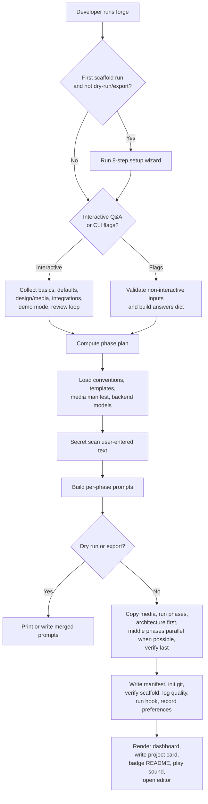

# Forge Flow Diagrams

These diagrams are now split into focused documents so each flow stays readable and easier to maintain.

Current state in this section is based on the scaffold path implemented in:

- `src/ubundiforge/cli.py`
- `src/ubundiforge/setup.py`
- `src/ubundiforge/prompts.py`
- `src/ubundiforge/router.py`
- `src/ubundiforge/prompt_builder.py`
- `src/ubundiforge/runner.py`
- `src/ubundiforge/verify.py`
- `src/ubundiforge/quality.py`
- `src/ubundiforge/media_assets.py`
- `src/ubundiforge/scaffold_log.py`

## Diagram Map

- [forge-input-flow.md](forge-input-flow.md) - first-run setup, interactive questionnaire, smart defaults, and review loop
- [forge-routing-and-execution.md](forge-routing-and-execution.md) - backend selection, quality-aware routing, phase merging, and execution order
- [forge-prompt-assembly.md](forge-prompt-assembly.md) - how Forge builds per-phase prompts from answers and context files
- [forge-runtime-pipeline.md](forge-runtime-pipeline.md) - end-to-end module flow from CLI entry to verification, logs, and editor launch

## High-Level Overview

## Notes

- `forge check`, `forge replay`, `forge evolve`, and `forge stats` exist too, but this diagram set focuses on the main scaffold workflow.
- The old single-file diagrams had drifted behind the code. The split docs aim to track the actual runtime path more closely.
