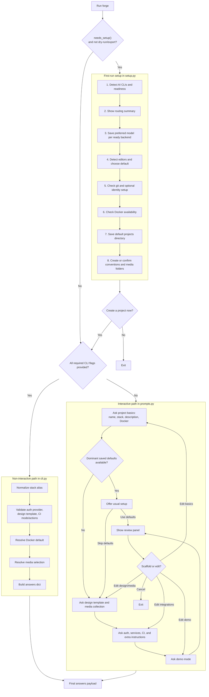

# Forge Input Flow

This document covers how Forge gets from `forge` to a finalized `answers` payload.

## Current Behavior

- Auto-setup runs only when Forge has never been configured and the command is not prompt-only.
- Non-interactive mode kicks in when `--name`, `--stack`, and `--description` are all provided.
- Interactive mode now includes smart defaults from prior scaffolds and a review/edit loop before generation starts.

## Setup And Input Collection

## Answers Shape

The finalized payload now consistently includes:

- `name`
- `stack`
- `description`
- `docker`
- `design_template`
- `media_collection`
- `auth_provider`
- `services`
- `ci` with `include`, `mode`, and `actions`
- `extra`
- `demo_mode`
