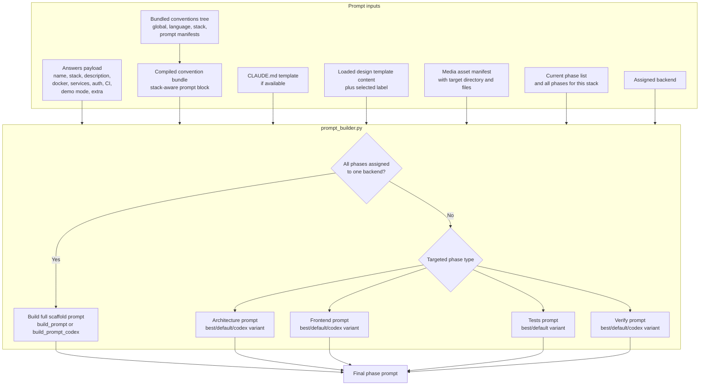
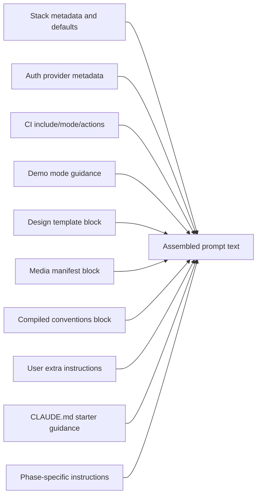

# Forge Prompt Assembly

This document covers the data that flows into `build_phase_prompt()` and how Forge decides which prompt variant to use.

## Current Behavior

- Forge builds one prompt per phase for execution.
- It also builds merged prompts for `--dry-run` and `--export`.
- If a single backend owns all phases, Forge uses the full legacy-style prompt. Otherwise it chooses targeted prompts for architecture, frontend, tests, or verify.

## Prompt Inputs And Variants

## What Changes Prompt Content

## Notes

- Forge now compiles conventions from the bundled `conventions/` tree before prompt assembly, and `forge admin conventions` previews the same compiled bundle that the prompt builder consumes.
- Legacy `.forge/conventions.md` and `~/.forge/conventions.md` files remain compatibility overrides, not the primary maintainer source of truth.
- Secret scanning happens before execution, but after answers are collected and before prompts are handed to an AI CLI.
- Model selection is resolved outside the prompt builder and passed to the backend CLI command separately.
