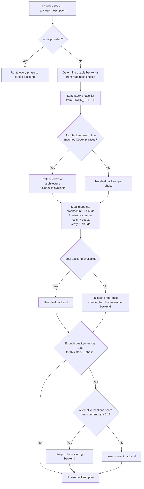
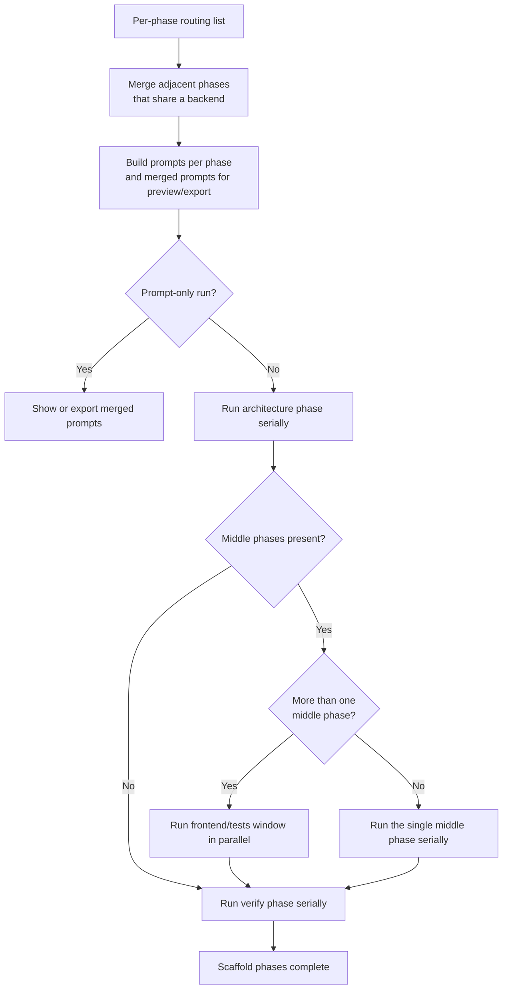

# Forge Routing And Execution

This document covers how Forge picks backends for each phase and how those phases are run.

## Current Behavior

- Routing is phase-based, not single-backend by default.
- The router considers explicit `--use`, installed and ready backends, project-description keywords, and quality-memory scores.
- Execution order is fixed: architecture first, verify last, with middle phases run in parallel when more than one exists.

## Routing Logic

## Merge And Execution Strategy

## Notes

- `merge_adjacent_phases()` reduces redundant prompt handoffs when the same backend owns neighboring phases.
- Parallel work only applies to the middle window. Architecture and verify stay serialized to preserve dependency order.
- If no usable backends are ready, Forge stops before any prompt is assembled or executed.
