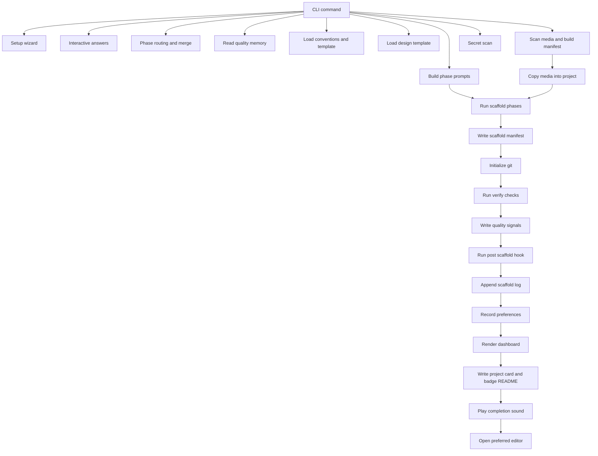

# Forge Runtime Pipeline

This document shows the end-to-end scaffold path across modules after Forge has a finalized `answers` payload.

## Current Behavior

- The main scaffold pipeline lives in `cli.py` and delegates to focused helper modules.
- Media copy happens before AI execution so generated code can reference imported assets immediately.
- Verification, quality memory, scaffold logs, and preference learning all happen after generation.

## End-To-End Module Flow

## Post-Scaffold Outputs

- Project manifest at `.forge/scaffold.json`
- Conventions snapshot at `.forge/conventions-snapshot.md`
- Optional imported media files in the stack-specific asset directory
- Optional git repository initialization
- Verification report used for dashboard rendering and quality-memory updates
- Global scaffold history in `~/.forge/scaffold.log`
- Updated preference memory in `~/.forge/preferences.json`
- Updated quality memory in `~/.forge/quality.jsonl`

## Related But Separate Paths

- `checks.py` powers `forge check` and `forge check --fix`
- `evolutions.py` powers `forge evolve`
- `replay` rebuilds prompts from `.forge/scaffold.json` instead of running the normal questionnaire
